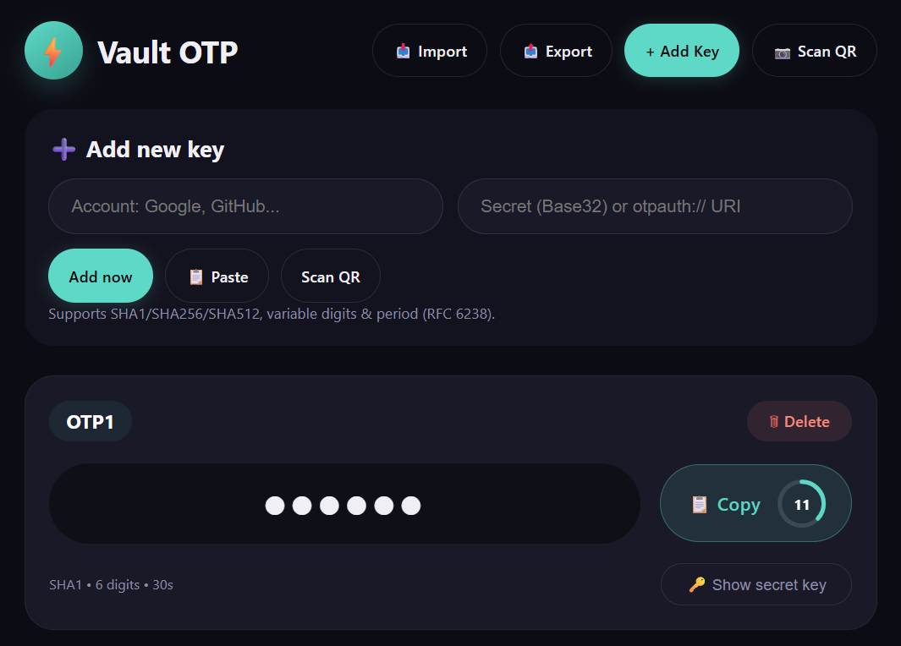

# Vault OTP + Password Manager

**Offline‑ready 2FA authenticator and secure credential vault**  
Encrypted backups (AES‑GCM), QR scanning, search, dark/light theme, and full password manager with CSV import.  
**No server, no tracking, works offline.**

[](https://opensource.org/licenses/MIT)


## **Live Demo**

👉 **https://nezarati.github.io/totp-authenticator-vault/** 👈

*This is a fully functional, client‑side application. Your secrets and keys never leave your device.*



---

## Features

### TOTP Authenticator (2FA)

- Fully compatible with Google Authenticator and any `otpauth://` URI.
- Supports **SHA1, SHA256, SHA512** algorithms, **6/7/8 digits**, and **30/60s periods**.
- Add keys manually (Base32 secret) or by **scanning QR codes** with your camera.
- **Tap the 6‑digit code** to hide or show it (privacy).
- **Copy button** with a **live countdown ring** – shows remaining seconds and changes colour when low.
- **Click any account name** to edit the name or secret; delete is inside the same popup.
- Clean minimal design – no distracting metadata under the code.

### Account Password Manager

- Store **website name, username, password, and optional URL**.
- **Click the title** of any entry to edit or delete it.
- **Tap the password field** to reveal or hide it (like TOTP codes).
- Copy username, password, or URL with one click.
- **Search** across both TOTP accounts and password entries (filter by name, username, URL).

### Import & Export (Encrypted JSON)

- Export your **entire vault** (TOTP + passwords) to a **password‑protected JSON file**.
- Encryption: **AES‑GCM** with **PBKDF2** (150k iterations, SHA‑256).
- **Optional default password** (`vault-default-key`) – convenient for testing, but you should use a strong custom password for real security.
- When you import an encrypted JSON file, the app **first tries the default password automatically**; if that fails, it asks you to enter the password.
- Also supports **legacy plain JSON arrays** (TOTP only).

### CSV Import (Chrome passwords)

- Import passwords directly from a **Google Chrome‑exported CSV** file.
- Expected columns (case‑insensitive): `name`, `url`, `username`, `password`.
- Each login becomes a credential entry.

### Additional Features

- **Global search** – type anywhere to filter both lists.
- **Unsaved changes warning** – alerts you before closing the page if modifications are not exported.
- **Dark / Light theme** – follows system preference by default, with a manual toggle (🌙/☀️ icon).
- **Drag & drop** – drop a `.json` or `.csv` file anywhere on the page to import.
- **QR code scanning** (jsQR library) – loads **only on first use** to avoid unnecessary network requests.
- **Clipboard copy** for all sensitive data (TOTP codes, passwords, secrets) with friendly toasts.
- **Mobile‑first responsive design** – works perfectly on phones, tablets, and desktops.

---

## How to Use

1. **Open the app** – serve `index.html` or use the [live demo](#).
2. **Add a TOTP key** – click `+ Add` under *Authenticator (TOTP)*, paste a secret or URI, or scan a QR code.
3. **Add a password** – click `+ Add` under *Account Password Manager*, fill the form.
4. **Edit anything** – click on any title (TOTP account name or credential name) to open the edit popup.
5. **Search** – use the search bar at the top to quickly find accounts or logins.
6. **Back up your vault** – click `Export`, choose a strong password (or tick “Use default” for convenience), save the `.json` file.
7. **Restore** – click `Import`, select your `.json` file. If it was encrypted with a custom password, type it when prompted.

---

## Security & Encryption

- All data stays **only in your browser’s memory** – nothing is sent over the network.
- Exported files are **encrypted** before leaving your device.
- The **default password** is intentionally weak (`vault-default-key`). Only use it for testing or on trusted devices.
- Web Crypto API (native) is used for all cryptographic operations.
- QR scanning uses a CDN for `jsQR`, but the library is loaded **lazily** – if you are offline, scanning will gracefully fail with a friendly error.

---

## Supported File Formats

### Encrypted JSON (`.json`)

Structure:
```json
{
  "version": 1,
  "salt": "...",
  "iv": "...",
  "ciphertext": "..."
}
